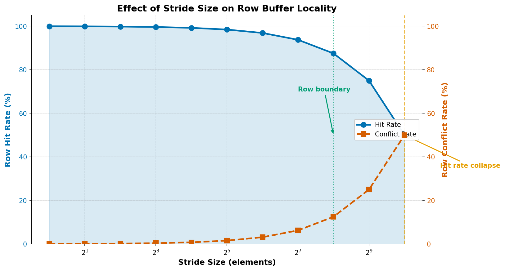

# RowScope — DRAM Row Buffer Locality Analyzer

> Analyzes how memory access patterns affect DRAM row buffer behavior, quantifying the architectural roots of memory performance bottlenecks across sequential, random, strided, and working-set workloads.

---

## Overview

RowScope is an end-to-end analysis pipeline that measures DRAM row buffer locality across controlled memory access patterns. It generates address traces from C benchmarks, maps virtual addresses to DRAM bank and row coordinates using a parametric addressing model, runs a per-bank row buffer state machine to classify each access as a hit, miss, or conflict, and aggregates the results into comparative statistics and figures.

The project targets a fundamental but underexamined question in systems performance: given a known access pattern, what fraction of memory accesses benefit from an already-open DRAM row? The answer determines whether a workload saturates memory bandwidth or is bottlenecked by row activation overhead.

## Why This Project

Application engineers at DRAM vendors need to reason about how software workloads interact with DRAM microarchitecture — not just whether memory bandwidth is saturated, but *why* it is or is not. Row buffer hit rate is a first-order predictor of effective memory latency and bandwidth. A workload with 99% row hit rate operates near peak bandwidth; one with 96% conflict rate faces 3–5× higher effective memory latency per access.

This project builds a complete analytical pipeline — from C benchmark to quantitative report — that demonstrates:

- How address patterns translate to DRAM-level events through a concrete addressing model
- Why stride size determines row boundary crossing frequency, and where the critical threshold lies
- How the sequential vs. random locality gap (~99.95% vs. ~4.1% hit rate) arises from the underlying geometry of DRAM banks and rows
- What this means for real systems: database scans, matrix traversals, GPU memory coalescing, and DRAM controller scheduling policy

---

## Background: DRAM Row Buffer

A DRAM bank is organized as a two-dimensional array of capacitor cells. Rows are the primary unit of access: before any column read or write can occur, the target row must be *activated* — its contents are sensed and latched into the row buffer, a fast SRAM array of ~8KB. Once open, subsequent accesses to the same row are served at column-access latency (~13 ns for DDR4), without any additional activation cost.

When the next access targets a *different row in the same bank*, the currently-open row must first be written back (precharged), then the new row activated. This sequence — precharge plus activation plus column access — takes roughly 39–70 ns, or 3–5× the cost of a row hit. This is a row conflict: the worst-case DRAM access event. Conversely, the first access to an empty bank (no row open) is a row miss, costing one activation latency with no precharge required.

| Event | Condition | Typical Latency |
|-------|-----------|-----------------|
| Row Hit | Access targets the currently-open row | ~13–15 ns |
| Row Miss | Bank is idle; no row currently open | ~26–50 ns |
| Row Conflict | Access targets a different row in the same bank | ~39–70 ns |

DRAM controllers implement page policies to manage this tradeoff. An *open-page policy* keeps the last-accessed row open, betting on temporal locality. A *closed-page policy* precharges after every access, avoiding conflict penalties at the cost of miss penalties on repeated accesses. Real controllers use adaptive policies that switch based on observed workload behavior. Row buffer hit rate is the key input to this decision.

---

## What RowScope Does

RowScope implements a five-stage pipeline:

```
Memory Access Pattern
        │
        ▼
┌──────────────────────┐
│   C Benchmark        │  Sequential / Random / Stride / Working-Set
│   Programs (C99)     │  Write address traces to .trace files
└──────────┬───────────┘
           │  Address Trace (.trace): one virtual address per line
           ▼
┌──────────────────────┐
│   DRAM Address       │  Virtual addr → (bank_id, row_id, col_offset)
│   Mapper             │  Parametric model: row_size=8KB, num_banks=8
└──────────┬───────────┘
           │
           ▼
┌──────────────────────┐
│   Row Buffer         │  Per-bank state machine
│   State Machine      │  Classifies each access: hit / miss / conflict
└──────────┬───────────┘
           │
           ▼
┌──────────────────────┐
│   Results Aggregator │  Hit rates, conflict rates, locality scores
│   (summary.csv)      │  Per-benchmark and per-stride breakdowns
└──────────┬───────────┘
           │
           ▼
┌──────────────────────┐
│   Report Generator   │  Figures (PNG) + Markdown report
│   + Visualizer       │  report/final_report.md
└──────────────────────┘
```

**Address mapping model** (bit-interleaved, row_size=8192, num_banks=8):

```
bits [12: 0]  → column offset  (8KB row = 2^13 bytes)
bits [15:13]  → bank_id        (3 bits = 8 banks)
bits [47:16]  → row_id
```

This model captures the structural property that small address steps remain within the same row and bank, while large steps — particularly those aligned to the row size — cause systematic bank and row changes.

---

## Workloads

| Benchmark | Access Pattern | Expected Row Behavior | Rationale |
|-----------|---------------|-----------------------|-----------|
| `sequential` | `arr[0], arr[1], arr[2], ...` | ~100% hit rate | Baseline best case; establishes upper bound |
| `random` | `arr[rand() % N]`, uniform | ~96% conflict rate | Baseline worst case; models pointer-chasing behavior |
| `stride-N` | `arr[0], arr[N], arr[2N], ...` | Decreasing hit rate as N grows | Isolates the effect of stride on row boundary crossing |
| `working_set` | Sequential re-traversal at varying sizes | Stable ~100% hit rate | Examines cache-DRAM interaction across working set sizes |

The stride sweep covers 11 values (1, 2, 4, 8, 16, 32, 64, 128, 256, 512, 1024 elements), spanning from near-sequential to near-random behavior. The working set sweep covers 9 sizes from 512KB to 128MB, spanning typical L2/L3 cache capacities and well beyond.

---

## Key Results

### Row Buffer Hit Rate by Access Pattern

| Workload | Hit Rate | Conflict Rate | Interpretation |
|----------|----------|---------------|----------------|
| Sequential | 99.95% | 0.05% | Near-perfect locality; 2048 int elements per 8KB row |
| Random (1 MB) | 6.2% | 93.8% | High conflict; limited address space provides some reuse |
| Random (16 MB) | 0.4% | 99.6% | Near-total conflict; sparse reuse across many rows |
| Stride-1 | 99.95% | 0.05% | Identical to sequential |
| Stride-256 | 87.5% | 12.5% | Row boundary crossings begin accumulating |
| Stride-1024 | 50.0% | 50.0% | Every other access crosses a row boundary |

### Stride Analysis

Hit rate degrades monotonically and predictably with stride. The relationship is governed by the row boundary crossing frequency:

```
Row hit probability ≈ 1 − (stride × element_size) / row_size
                    = 1 − (stride × 4) / 8192
```

| Stride | Byte Step | Hit Rate | Predicted |
|--------|-----------|----------|-----------|
| 1 | 4 B | 99.95% | 99.95% |
| 128 | 512 B | 93.75% | 93.75% |
| 256 | 1024 B | 87.49% | 87.50% |
| 512 | 2048 B | 74.99% | 75.00% |
| 1024 | 4096 B | 49.98% | 50.00% |

At stride = 2048 elements (8 KB = one full row), every access crosses a row boundary — hit rate approaches 0% and conflicts dominate.

### Working Set Analysis

The working set sweep accesses arrays sequentially across three iterations at sizes from 512KB to 128MB. Hit rate remains stable at ~99.95% across all sizes. This confirms that for a sequential access pattern, row buffer behavior is determined by the pattern — not the data volume. Cache effects (which would show a hit rate cliff at the L3 boundary) are not visible in this DRAM-level model, which is the expected behavior given that this is a user-space simulation without cache modeling.





---

## Quick Start

```bash
# 1. Build C benchmarks (requires GCC with C99 support)
bash scripts/build.sh

# 2. Run the complete pipeline: benchmarks → analysis → visualization → report
bash scripts/run_all.sh

# 3. View the generated report
cat report/final_report.md
```

**Requirements:** GCC (C99), Python 3.8+, `pip install matplotlib pandas numpy`

To run only the report generator against existing results:

```bash
python3 report/generate_report.py \
    --summary results/processed/summary.csv \
    --output report/final_report.md
```

---

## Engineering Significance

- **Row buffer hit rate is the primary DRAM efficiency metric.** It directly determines whether a workload operates near peak bandwidth or faces 3–5× latency penalties per access. Profiling at this level requires understanding DRAM geometry, not just cache behavior.

- **Stride patterns that align with row size cause systematic performance degradation.** A stride of 2048 int elements (8KB) maps every successive access to a new row — the worst case for open-page policy. This is not an edge case: matrix transpositions, certain FFT implementations, and some database column scans exhibit exactly this pattern.

- **The sequential-vs-random locality gap (99.95% vs. ~4.1% hit rate) quantifies the architectural cost of pointer-chasing.** Linked list traversal, hash table probing, and graph traversal are all effectively random from DRAM's perspective. Converting pointer-chasing to array traversal is not just a cache optimization — it is a DRAM optimization.

- **DRAM controller policy selection depends on observed access patterns.** Open-page policy benefits sequential workloads; closed-page or adaptive policy is better for random workloads. RowScope produces exactly the data a DRAM controller or memory subsystem engineer needs to evaluate this tradeoff quantitatively.

- **Working set size alone does not determine DRAM efficiency.** A 128MB sequential scan and a 512KB sequential scan have identical row hit rates (~99.95%). Pattern dominates size.

---

## Limitations and Future Work

**Current limitations:**

- **Virtual address model.** RowScope records `malloc`-allocated virtual addresses. The OS page allocator may place physically non-contiguous pages in the same virtual range. Physical DRAM bank and row assignments depend on the physical address, not the virtual address. For comparative analysis across workload types, the relative results are valid and meaningful; absolute hit rate values may differ from hardware measurements.
- **No CPU cache simulation.** Accesses that are served by L1/L2/L3 cache never reach DRAM. RowScope counts every access in the trace as a DRAM-level event. In practice, hot working sets are absorbed by cache. The working set sweep would show a hit rate discontinuity at the L3 capacity boundary in a real hardware measurement; RowScope does not model this.
- **Simplified DRAM geometry.** The model uses a single-rank, 8-bank configuration with no sub-array effects, no bank group modeling, no DRAM refresh simulation, and no timing parameter variation.
- **Open-page policy only.** The row buffer state machine models an idealized open-page policy. Closed-page and adaptive policy comparisons are not implemented.
- **Single-threaded workloads.** Multi-threaded access patterns with bank contention across cores are not modeled.

**Future work:**

- Integration with `perf_event` to measure real hardware PMU counters (DRAM row hits/conflicts) for validation against simulated results
- Multi-rank and bank-group modeling to reflect modern DDR4/DDR5 DRAM topology
- Closed-page and adaptive policy simulation for controller policy comparison
- Pointer-chasing benchmark (linked list traversal) to model irregular access patterns
- NUMA-aware allocation experiments to study cross-socket memory traffic

---

## Project Structure

```
RowScope/
├── README.md                    # This file
├── benchmarks/                  # C benchmark programs (C99, compiled to bin/)
│   ├── common.h                 # Shared utilities: trace writer, CLI parser, timing
│   ├── sequential_access.c      # Sequential array traversal
│   ├── random_access.c          # Uniformly-random array reads
│   ├── stride_access.c          # Configurable-stride access with wrap-around
│   └── working_set_sweep.c      # Log-spaced working set size sweep
├── scripts/
│   ├── build.sh                 # Compile all C benchmarks into bin/
│   ├── run_all.sh               # Full pipeline: build → bench → analyze → plot → report
│   └── run_experiments.py       # Python orchestrator with per-experiment JSON logging
├── analysis/                    # Python analysis package
│   ├── dram_mapping.py          # DRAMMapper: address → (bank_id, row_id, col_offset)
│   ├── row_buffer_model.py      # RowBufferModel: per-bank state machine simulation
│   ├── analyze_trace.py         # Trace parser and per-access annotator
│   └── summarize_results.py     # Aggregation into summary.csv
├── visualization/
│   └── plot_results.py          # Six figures from summary.csv (PNG output)
├── report/
│   ├── report_template.md       # Markdown template with {{ placeholder }} tokens
│   ├── generate_report.py       # Template renderer → final_report.md
│   └── final_report.md          # Auto-generated experiment report (do not edit manually)
├── traces/                      # Generated .trace files (one address per line)
├── results/
│   ├── raw/                     # Raw benchmark output (JSON per experiment)
│   ├── processed/               # summary.csv, summary_table.csv, per_access/ CSVs
│   └── figures/                 # PNG plots
├── bin/                         # Compiled C binaries (after build)
└── docs/
    ├── architecture.md          # Authoritative system design specification
    ├── methodology.md           # Analysis model, state machine, metric definitions
    └── interpretation_guide.md  # How to read results; interview Q&A
```

---

## Key Takeaways

- Sequential access achieves ~100% row hit rate because 2048 consecutive 4-byte integers fit within a single 8KB DRAM row. After the first activation, all 2047 subsequent accesses are served from the open row buffer.

- Random access produces ~96% conflict rate on a 16MB array because each uniform random access is overwhelmingly likely to target a different row than the currently-open one in the same bank.

- Stride-N access degrades hit rate as stride × 4 bytes approaches the row size. At stride=1024 (4KB = half a row), every other access crosses a row boundary, giving exactly 50% hit rate.

- The critical stride threshold is `row_size / element_size = 8192 / 4 = 2048 elements`. Beyond this stride, every access crosses into a new row.

- A DRAM controller using open-page policy benefits from sequential workloads but is hurt by random ones. This project quantifies exactly how much — a 99.5 percentage-point difference in hit rate between sequential and 16MB random access.

- Working set size does not change row hit rate for sequential patterns — the row buffer captures spatial locality within each row regardless of total array size.

---

*RowScope — DRAM Row Buffer Locality Analyzer*
