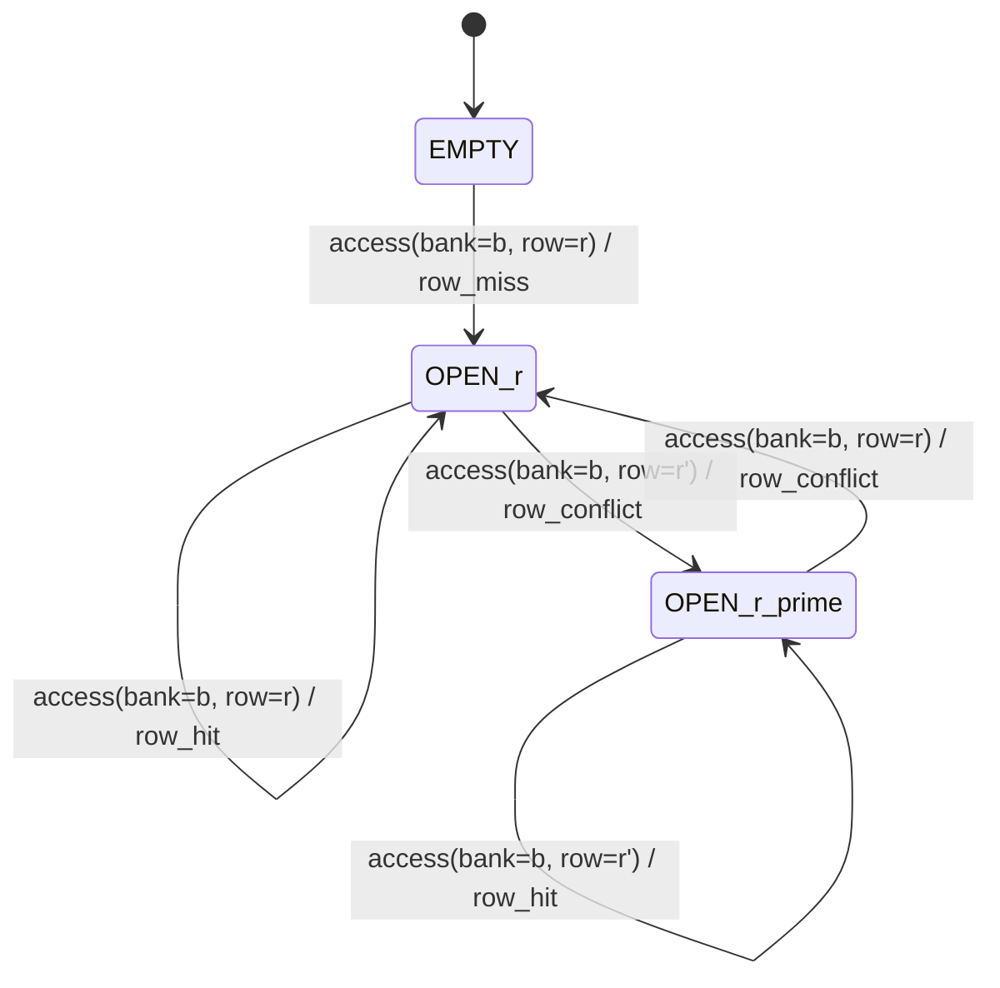

# RowScope Architecture Document

**Version**: 1.0
**Date**: 2026-03-11
**Author**: RowScope Senior Architect
**Status**: AUTHORITATIVE -- This document is the single source of truth for all implementation work.

---

## Table of Contents

1. [System Overview and Pipeline](#1-system-overview-and-pipeline)
2. [Repository Directory Structure](#2-repository-directory-structure)
3. [DRAM Address Mapping Model Specification](#3-dram-address-mapping-model-specification)
4. [Row Buffer State Machine Definition](#4-row-buffer-state-machine-definition)
5. [Trace File Format Specification](#5-trace-file-format-specification)
6. [Analysis Output Schema](#6-analysis-output-schema)
7. [Inter-Module Interface Contracts (Python)](#7-inter-module-interface-contracts-python)
8. [Benchmark C Program Interface](#8-benchmark-c-program-interface)
9. [Experiment Parameter Matrix](#9-experiment-parameter-matrix)
10. [Key Analysis Metrics Definitions](#10-key-analysis-metrics-definitions)
11. [Expected Experimental Hypotheses](#11-expected-experimental-hypotheses)
12. [Configuration Schema](#12-configuration-schema)
13. [Pipeline Orchestration](#13-pipeline-orchestration)

---

## 1. System Overview and Pipeline

RowScope is a DRAM Row Buffer Locality Analyzer. It measures how different memory access patterns interact with DRAM row buffer mechanics by:

1. **Generating** controlled memory access workloads (C benchmarks)
2. **Recording** address traces from those workloads
3. **Mapping** virtual addresses to DRAM bank/row/column using a configurable model
4. **Simulating** per-bank row buffer state machines to classify each access
5. **Aggregating** hit/miss/conflict statistics
6. **Visualizing** results as publication-quality plots
7. **Reporting** findings in a structured final report

### Pipeline Diagram

```
+------------------+     +----------------+     +------------------+
| Benchmark Module |     | Analyzer Module|     | Visualizer Module|
| (C programs)     |---->| (Python)       |---->| (Python)         |
+------------------+     +----------------+     +------------------+
        |                       |                       |
        v                       v                       v
  data/traces/            results/processed/       figures/*.png
  *.trace                 summary.csv              docs/final_report.md
                          per_access/*.csv
```

### Data Flow

```
[C Benchmark] --stdout/file--> [.trace file]
                                     |
                         [analyze_trace.py]
                           |              |
                    [DRAMMapper]   [RowBufferModel]
                           |              |
                           v              v
                    [bank,row,col]  [hit/miss/conflict]
                           |              |
                           +------+-------+
                                  |
                           [summarize_results.py]
                                  |
                                  v
                          [summary.csv]
                                  |
                          [visualize.py]
                                  |
                                  v
                          [figures/*.png]
```

---

## 2. Repository Directory Structure

```
RowScope/
|-- README.md                          # Project overview and quick start
|-- Makefile                           # Build system for C benchmarks + pipeline targets
|-- requirements.txt                   # Python dependencies (matplotlib, pandas, numpy, pyyaml)
|-- run_all.sh                         # Single-command pipeline orchestrator
|
|-- config/
|   |-- default.yaml                   # Default DRAM and experiment configuration
|
|-- src/
|   |-- benchmarks/
|   |   |-- common.h                   # Shared definitions: timing macros, trace writer
|   |   |-- trace_writer.h             # Trace file writing interface (header-only)
|   |   |-- trace_writer.c             # Trace file writing implementation
|   |   |-- sequential_access.c        # Sequential array traversal benchmark
|   |   |-- random_access.c            # Random array access benchmark
|   |   |-- stride_access.c            # Configurable-stride access benchmark
|   |   |-- working_set_sweep.c        # Working set size sweep benchmark
|   |
|   |-- analyzer/
|   |   |-- __init__.py                # Package marker
|   |   |-- dram_mapping.py            # DRAMMapper class: address -> (bank, row, col)
|   |   |-- row_buffer_model.py        # RowBufferModel class: per-bank state machine
|   |   |-- analyze_trace.py           # Trace file parser and per-access analysis
|   |   |-- summarize_results.py       # Aggregation of per-trace results into summary CSV
|   |
|   |-- visualizer/
|       |-- __init__.py                # Package marker
|       |-- visualize.py               # All chart generation logic
|
|-- scripts/
|   |-- run_benchmarks.sh              # Compile and run all C benchmarks
|   |-- run_analysis.sh                # Run Python analysis on all traces
|   |-- run_visualization.sh           # Generate all figures from results
|   |-- run_pipeline.sh                # End-to-end pipeline (calls above 3 scripts)
|
|-- data/
|   |-- traces/                        # Generated trace files from benchmarks
|
|-- results/
|   |-- processed/
|   |   |-- summary.csv                # Aggregate results across all experiments
|   |-- per_access/                    # Per-access annotated CSVs (optional, verbose)
|
|-- figures/                           # Generated PNG plots
|
|-- tests/
|   |-- test_dram_mapping.py           # Unit tests for DRAMMapper
|   |-- test_row_buffer_model.py       # Unit tests for RowBufferModel
|   |-- test_trace_format.py           # Trace format validation tests
|   |-- test_analysis.py               # Integration tests for analysis pipeline
|   |-- test_end_to_end.py             # End-to-end pipeline smoke test
|
|-- docs/
    |-- architecture.md                # THIS DOCUMENT
    |-- final_report.md                # Auto-generated analysis report
```

---

## 3. DRAM Address Mapping Model Specification

### 3.1 Overview

This project uses a **simplified logical DRAM address mapping model**. We do not reverse-engineer physical DRAM controller address mapping. Instead, we apply a deterministic function from byte address to (bank_id, row_id, col_offset) using configurable parameters.

> **ASSUMPTION:** We treat virtual addresses from `malloc`-allocated arrays as if they were physical addresses. In practice, the OS uses virtual-to-physical page mapping, but for the purpose of analyzing access pattern locality, the logical model is sufficient and produces valid comparative results across workloads.

### 3.2 Parameters

| Parameter | Type | Default | Valid Range | Description |
|-----------|------|---------|-------------|-------------|
| `row_size` | int (bytes) | 8192 | 1024--65536, power of 2 | Size of one DRAM row (row buffer capacity) |
| `num_banks` | int | 16 | 1--64, power of 2 | Number of DRAM banks |
| `interleaving_scheme` | string | `"sequential"` | `"sequential"` or `"bitwise"` | Address decomposition method |

### 3.3 Scheme A: Sequential (Contiguous) Mapping -- DEFAULT

In this scheme, address space is divided into contiguous blocks. Each block of `row_size` bytes maps to one bank, cycling through banks sequentially.

**Address decomposition formula:**

```
Given: addr (byte address), ROW_SIZE, NUM_BANKS

page_addr   = addr // ROW_SIZE                    # which row-sized page this address falls in
bank_id     = page_addr % NUM_BANKS               # cycle through banks
row_id      = page_addr // NUM_BANKS              # which row within this bank
col_offset  = addr % ROW_SIZE                     # offset within the row
```

Equivalently in bit operations (when ROW_SIZE and NUM_BANKS are powers of 2):

```
Let R = log2(ROW_SIZE)   # e.g., log2(8192) = 13
Let B = log2(NUM_BANKS)  # e.g., log2(16) = 4

col_offset = addr & (ROW_SIZE - 1)               # bits [R-1 : 0]
bank_id    = (addr >> R) & (NUM_BANKS - 1)        # bits [R+B-1 : R]
row_id     = addr >> (R + B)                      # bits [31 : R+B]
```

With defaults (ROW_SIZE=8192, NUM_BANKS=16):
- `col_offset` = bits [12:0] (13 bits)
- `bank_id` = bits [16:13] (4 bits)
- `row_id` = bits [31:17] (remaining upper bits)

**Worked example: addr = 270336 (0x42000)**

```
ROW_SIZE = 8192, NUM_BANKS = 16
R = 13, B = 4

addr        = 270336
binary      = 0b 0000 0000 0000 0100 0010 0000 0000 0000

col_offset  = 270336 & 8191  = 270336 & 0x1FFF = 0    # bits [12:0]
bank_id     = (270336 >> 13) & 15 = 33 & 15 = 1       # bits [16:13]
row_id      = 270336 >> 17 = 2                          # bits [31:17]

Verification: row_id * NUM_BANKS * ROW_SIZE + bank_id * ROW_SIZE + col_offset
            = 2 * 16 * 8192 + 1 * 8192 + 0
            = 262144 + 8192 + 0 = 270336  CORRECT
```

**Second worked example: addr = 65536 (0x10000)**

```
col_offset  = 65536 & 8191 = 0
bank_id     = (65536 >> 13) & 15 = 8 & 15 = 8
row_id      = 65536 >> 17 = 0

Verification: 0 * 16 * 8192 + 8 * 8192 + 0 = 65536  CORRECT
```

### 3.4 Scheme B: Bitwise (XOR-based) Mapping

This scheme XORs higher address bits into the bank selection to reduce bank conflicts for strided access patterns.

```
col_offset = addr & (ROW_SIZE - 1)                          # bits [R-1 : 0]
raw_bank   = (addr >> R) & (NUM_BANKS - 1)                  # bits [R+B-1 : R]
xor_bits   = (addr >> (R + B)) & (NUM_BANKS - 1)            # bits [R+2B-1 : R+B]
bank_id    = raw_bank ^ xor_bits                             # XOR of two fields
row_id     = addr >> (R + B)                                 # same as sequential
```

**Worked example: addr = 270336 (0x42000), ROW_SIZE=8192, NUM_BANKS=16**

```
col_offset = 0
raw_bank   = (270336 >> 13) & 15 = 33 & 15 = 1
xor_bits   = (270336 >> 17) & 15 = 2 & 15 = 2
bank_id    = 1 ^ 2 = 3
row_id     = 270336 >> 17 = 2
```

### 3.5 Default Scheme Selection

**Default: Sequential (Contiguous) Mapping**

Rationale:
1. It is the simplest to understand and debug.
2. It directly reveals how contiguous memory layouts interact with bank interleaving.
3. Sequential access patterns clearly demonstrate row buffer reuse within a bank.
4. The bitwise scheme can be enabled via configuration for advanced experiments.

### 3.6 Array Index to Byte Address Mapping

When benchmarks allocate an `int` array via `malloc`, the relationship is:

```
byte_address = base_address + index * sizeof(int)
```

> **ASSUMPTION:** `sizeof(int) = 4` bytes on the target platform (standard for LP64/ILP32). All stride values in the experiment matrix refer to element counts (not byte counts). A stride of `S` elements means `S * 4` bytes between consecutive accesses.

For trace analysis, the benchmark records the absolute virtual address of each access. The analyzer subtracts no base address -- it processes raw addresses directly.

> **ASSUMPTION:** The `base_address` returned by `malloc` is treated as-is. Since we analyze relative patterns (not absolute DRAM locations), the base address offset does not affect comparative results between workloads. The mapping is deterministic given the same address, so patterns are preserved.

---

## 4. Row Buffer State Machine Definition

### 4.1 States

Each of the `NUM_BANKS` banks has an independent state machine with two states:

| State | Description |
|-------|-------------|
| `EMPTY` | No row is currently open in this bank's row buffer |
| `OPEN(row_id)` | Row `row_id` is currently loaded in this bank's row buffer |

**Initialization:** All banks start in `EMPTY` state.

### 4.2 Transition Rules

| # | Current State | Condition | Next State | Event Type | Metric Incremented |
|---|---------------|-----------|------------|------------|--------------------|
| T1 | `EMPTY` | Access to bank `b`, any row `r` | `OPEN(r)` | **row_miss** | `misses += 1` |
| T2 | `OPEN(r)` | Access to bank `b`, same row `r` | `OPEN(r)` | **row_hit** | `hits += 1` |
| T3 | `OPEN(r)` | Access to bank `b`, different row `r'` | `OPEN(r')` | **row_conflict** | `conflicts += 1` |

Note: Accesses to a **different bank** do not affect this bank's state machine at all. Each bank is fully independent.

### 4.3 State Machine Diagram (Mermaid)



### 4.4 Trace Walkthrough Example

Configuration: `ROW_SIZE=8192, NUM_BANKS=16` (sequential scheme)

Consider these 6 accesses to a contiguous array starting at address 0:

| Step | Address | bank_id | row_id | col_offset | Bank State Before | Event | Bank State After |
|------|---------|---------|--------|------------|-------------------|-------|-----------------|
| 1 | 0 | 0 | 0 | 0 | Bank0: `EMPTY` | **miss** | Bank0: `OPEN(0)` |
| 2 | 4 | 0 | 0 | 4 | Bank0: `OPEN(0)` | **hit** | Bank0: `OPEN(0)` |
| 3 | 8192 | 1 | 0 | 0 | Bank1: `EMPTY` | **miss** | Bank1: `OPEN(0)` |
| 4 | 8196 | 1 | 0 | 4 | Bank1: `OPEN(0)` | **hit** | Bank1: `OPEN(0)` |
| 5 | 131072 | 0 | 1 | 0 | Bank0: `OPEN(0)` | **conflict** | Bank0: `OPEN(1)` |
| 6 | 131076 | 0 | 1 | 4 | Bank0: `OPEN(1)` | **hit** | Bank0: `OPEN(1)` |

Verification for step 5: `addr=131072`, `131072 >> 13 = 16`, `16 & 15 = 0` (bank 0), `131072 >> 17 = 1` (row 1). Bank 0 had row 0 open, so this is a **conflict**.

Verification for step 3: `addr=8192`, `8192 >> 13 = 1`, `1 & 15 = 1` (bank 1), `8192 >> 17 = 0` (row 0). Bank 1 was `EMPTY`, so this is a **miss**.

---

## 5. Trace File Format Specification

### 5.1 Primary Format: Plain Text Trace (`.trace`)

The benchmark C programs produce a simple text format optimized for minimal I/O overhead:

**Structure:**
```
# key1=value1 key2=value2 ...
<decimal_address>
<decimal_address>
...
```

**Header line (line 1):** Starts with `#` followed by space-separated key=value metadata pairs.

Required metadata keys:

| Key | Type | Description |
|-----|------|-------------|
| `benchmark` | string | One of: `sequential`, `random`, `stride`, `working_set` |
| `size` | uint64 | Array size in bytes |
| `stride` | uint32 | Stride in elements (for stride benchmark; 1 for sequential; 0 for random) |
| `accesses` | uint64 | Total number of access records in the file |
| `element_size` | uint32 | Size of each array element in bytes (always 4 for `int`) |
| `seed` | uint32 | RNG seed (0 if not applicable) |
| `iterations` | uint32 | Number of full array traversals (for sequential/working_set) |

**Data lines (line 2+):** One decimal address per line. No leading/trailing whitespace. No blank lines.

**Example trace file (`sequential_16MB_stride1.trace`):**

```
# benchmark=sequential size=16777216 stride=1 accesses=4194304 element_size=4 seed=0 iterations=1
134217728
134217732
134217736
134217740
134217744
```

### 5.2 File Naming Convention

```
data/traces/{benchmark}_{size_human}_{param}.trace
```

Examples:
- `data/traces/sequential_16MB_stride1.trace`
- `data/traces/random_4MB_100000acc.trace`
- `data/traces/stride_16MB_stride64.trace`
- `data/traces/working_set_8MB_iter3.trace`

### 5.3 Size Limits and Chunking

| Constraint | Value |
|-----------|-------|
| Maximum recommended trace file size | 500 MB |
| Maximum accesses per trace | 100,000,000 |
| For experiments exceeding this limit | Reduce `accesses` or `iterations` parameter |

> **ASSUMPTION:** For the default experiment matrix, the largest trace (sequential 64MB, 1 iteration) produces ~16M lines at ~10 bytes each = ~160MB, well within limits. No chunking is needed for the default experiments.

### 5.4 Access Type

All accesses in the default benchmarks are **reads** (`R`). The trace format does not include an explicit access type column because:
1. The C benchmarks perform read-only array traversals.
2. For row buffer analysis, the hit/miss/conflict classification is identical for reads and writes.
3. This simplifies the trace format and reduces file size.

> **ASSUMPTION:** Read-only access patterns are sufficient for demonstrating row buffer locality behavior. The analyzer treats all accesses identically regardless of read/write type.

---

## 6. Analysis Output Schema

### 6.1 Summary CSV: `results/processed/summary.csv`

This file contains one row per experiment configuration.

| Column | Type | Unit | Description |
|--------|------|------|-------------|
| `benchmark` | string | -- | Benchmark name: `sequential`, `random`, `stride`, `working_set` |
| `array_size_bytes` | uint64 | bytes | Array allocation size |
| `array_size_mb` | float | MB | Array size in megabytes (`array_size_bytes / 1048576`) |
| `stride` | uint32 | elements | Stride in elements |
| `stride_bytes` | uint32 | bytes | Stride in bytes (`stride * element_size`) |
| `num_accesses` | uint64 | count | Total memory accesses in the trace |
| `row_hit_count` | uint64 | count | Number of row buffer hits |
| `row_miss_count` | uint64 | count | Number of row buffer misses (first access to empty bank) |
| `row_conflict_count` | uint64 | count | Number of row buffer conflicts |
| `row_hit_rate` | float | ratio [0,1] | `row_hit_count / num_accesses` |
| `row_miss_rate` | float | ratio [0,1] | `row_miss_count / num_accesses` |
| `row_conflict_rate` | float | ratio [0,1] | `row_conflict_count / num_accesses` |
| `locality_score` | float | ratio [-1,1] | `row_hit_rate - row_conflict_rate` |
| `unique_rows_accessed` | uint64 | count | Number of distinct (bank_id, row_id) pairs seen |
| `unique_banks_accessed` | uint32 | count | Number of distinct banks accessed |
| `trace_file` | string | -- | Path to source trace file |

**Invariant:** For every row: `row_hit_count + row_miss_count + row_conflict_count == num_accesses`

**Example rows:**

```csv
benchmark,array_size_bytes,array_size_mb,stride,stride_bytes,num_accesses,row_hit_count,row_miss_count,row_conflict_count,row_hit_rate,row_miss_rate,row_conflict_rate,locality_score,unique_rows_accessed,unique_banks_accessed,trace_file
sequential,16777216,16.0,1,4,4194304,4186112,8192,0,0.998047,0.001953,0.000000,0.998047,8192,16,data/traces/sequential_16MB_stride1.trace
random,16777216,16.0,0,0,100000,2850,1200,95950,0.028500,0.012000,0.959500,-0.931000,7850,16,data/traces/random_16MB_100000acc.trace
```

### 6.2 Per-Access CSV: `results/per_access/{trace_basename}_annotated.csv`

Optional verbose output. One row per memory access.

| Column | Type | Unit | Description |
|--------|------|------|-------------|
| `access_seq` | uint64 | count | Sequential access number (0-indexed) |
| `address` | uint64 | bytes | Virtual byte address |
| `bank_id` | uint32 | -- | Mapped DRAM bank ID |
| `row_id` | uint32 | -- | Mapped DRAM row ID |
| `col_offset` | uint32 | bytes | Column offset within row |
| `event` | string | -- | One of: `hit`, `miss`, `conflict` |
| `prev_row_id` | int64 | -- | Previously open row in this bank (-1 if bank was EMPTY) |

**Example:**

```csv
access_seq,address,bank_id,row_id,col_offset,event,prev_row_id
0,134217728,0,1024,0,miss,-1
1,134217732,0,1024,4,hit,1024
2,134225920,1,1024,0,miss,-1
3,134225924,1,1024,4,hit,1024
4,134348800,0,1025,0,conflict,1024
```

### 6.3 Per-Bank CSV: `results/processed/per_bank/{trace_basename}_banks.csv`

One row per bank, per experiment.

| Column | Type | Description |
|--------|------|-------------|
| `bank_id` | uint32 | Bank identifier |
| `total_accesses` | uint64 | Total accesses to this bank |
| `row_hits` | uint64 | Hit count for this bank |
| `row_misses` | uint64 | Miss count for this bank |
| `row_conflicts` | uint64 | Conflict count for this bank |
| `hit_rate` | float | Per-bank hit rate |
| `conflict_rate` | float | Per-bank conflict rate |
| `unique_rows` | uint64 | Distinct rows accessed in this bank |

### 6.4 Missing/Invalid Value Representation

- Missing numeric values: `-1` for integers, `NaN` for floats
- Missing string values: empty string `""`
- All CSV files use UTF-8 encoding, Unix line endings (`\n`), and comma delimiters
- Float values: 6 decimal places

---

## 7. Inter-Module Interface Contracts (Python)

### 7.1 `src/analyzer/dram_mapping.py` -- DRAMMapper

```python
class DRAMMapper:
    """Maps byte addresses to DRAM (bank_id, row_id, col_offset) tuples."""

    def __init__(self, row_size: int = 8192, num_banks: int = 16,
                 scheme: str = "sequential") -> None:
        """
        Args:
            row_size: Row buffer size in bytes. Must be a power of 2.
            num_banks: Number of DRAM banks. Must be a power of 2.
            scheme: "sequential" or "bitwise".
        Raises:
            ValueError: If row_size or num_banks is not a power of 2,
                        or if scheme is not recognized.
        """
        ...

    def map(self, address: int) -> tuple[int, int, int]:
        """
        Map a byte address to DRAM coordinates.

        Args:
            address: Byte address (non-negative integer).
        Returns:
            (bank_id, row_id, col_offset) tuple.
        Raises:
            ValueError: If address is negative.
        """
        ...

    def get_row_size(self) -> int:
        """Return configured row size in bytes."""
        ...

    def get_num_banks(self) -> int:
        """Return configured number of banks."""
        ...

    def get_scheme(self) -> str:
        """Return configured interleaving scheme name."""
        ...
```

### 7.2 `src/analyzer/row_buffer_model.py` -- RowBufferModel

```python
class RowBufferModel:
    """Simulates per-bank row buffer state machines."""

    def __init__(self, mapper: DRAMMapper) -> None:
        """
        Initialize with a DRAMMapper. Creates NUM_BANKS independent
        state machines, all starting in EMPTY state.
        """
        ...

    def process_access(self, address: int) -> str:
        """
        Process a single memory access.

        Args:
            address: Byte address of the access.
        Returns:
            One of: "hit", "miss", "conflict"
        """
        ...

    def get_stats(self) -> dict:
        """
        Return aggregate statistics.

        Returns:
            {
                "hits": int,
                "misses": int,
                "conflicts": int,
                "total": int,
                "hit_rate": float,
                "miss_rate": float,
                "conflict_rate": float,
                "locality_score": float,
                "unique_rows": int,
                "unique_banks": int,
            }
        """
        ...

    def get_per_bank_stats(self) -> list[dict]:
        """
        Return per-bank statistics.

        Returns:
            List of dicts, one per bank, each containing:
            {
                "bank_id": int,
                "total_accesses": int,
                "hits": int,
                "misses": int,
                "conflicts": int,
                "hit_rate": float,
                "conflict_rate": float,
                "unique_rows": int,
            }
        """
        ...

    def reset(self) -> None:
        """Reset all bank states to EMPTY and clear all counters."""
        ...
```

### 7.3 `src/analyzer/analyze_trace.py` -- Trace Analysis

```python
import pandas as pd
from .dram_mapping import DRAMMapper
from .row_buffer_model import RowBufferModel

def parse_trace_header(trace_path: str) -> dict:
    """
    Parse the metadata header line of a trace file.

    Args:
        trace_path: Path to .trace file.
    Returns:
        Dict of metadata key-value pairs. All values are strings.
    Raises:
        FileNotFoundError: If trace_path does not exist.
        ValueError: If header line is missing or malformed.
    """
    ...

def analyze_trace_file(trace_path: str, mapper: DRAMMapper,
                       per_access_output: str | None = None) -> dict:
    """
    Analyze a single trace file.

    Args:
        trace_path: Path to .trace file.
        mapper: Configured DRAMMapper instance.
        per_access_output: If not None, path to write per-access annotated CSV.
    Returns:
        Dict containing all columns defined in summary.csv schema (section 6.1),
        with the 'trace_file' key set to trace_path.
    Raises:
        FileNotFoundError: If trace_path does not exist.
        ValueError: If trace contains non-numeric lines (other than header).
    """
    ...

def batch_analyze(trace_dir: str, mapper: DRAMMapper,
                  per_access_dir: str | None = None) -> pd.DataFrame:
    """
    Analyze all .trace files in a directory.

    Args:
        trace_dir: Directory containing .trace files.
        mapper: Configured DRAMMapper instance.
        per_access_dir: If not None, directory to write per-access CSVs.
    Returns:
        DataFrame with one row per trace file, columns matching summary.csv schema.
    """
    ...
```

**CLI invocation:**

```bash
python -m src.analyzer.analyze_trace \
    --trace-dir data/traces/ \
    --output results/processed/summary.csv \
    --config config/default.yaml \
    --per-access-dir results/per_access/ \
    --verbose
```

**Exit codes:**
| Code | Meaning |
|------|---------|
| 0 | Success |
| 1 | Configuration error (invalid YAML, missing required fields) |
| 2 | Trace file error (file not found, parse error) |
| 3 | Output error (cannot write to output path) |

### 7.4 `src/analyzer/summarize_results.py` -- Result Aggregation

```python
import pandas as pd

def load_summary(summary_path: str) -> pd.DataFrame:
    """Load summary.csv into a DataFrame."""
    ...

def generate_summary_table(df: pd.DataFrame) -> pd.DataFrame:
    """
    Generate a human-readable summary table grouped by benchmark type.
    Returns DataFrame with columns: benchmark, avg_hit_rate, avg_conflict_rate,
    avg_locality_score, num_experiments.
    """
    ...

def save_summary(df: pd.DataFrame, output_path: str) -> None:
    """Write DataFrame to CSV with 6-decimal float precision."""
    ...
```

### 7.5 `src/visualizer/visualize.py` -- Visualization

```python
def generate_all_figures(summary_csv: str, output_dir: str,
                         config: dict | None = None) -> list[str]:
    """
    Generate all required figures from summary data.

    Args:
        summary_csv: Path to results/processed/summary.csv
        output_dir: Directory to save PNG files (e.g., figures/)
        config: Optional config dict for plot customization
    Returns:
        List of paths to generated PNG files.
    """
    ...
```

**Required figures (minimum 5):**

| # | Filename | Chart Type | X-axis | Y-axis | Data |
|---|----------|-----------|--------|--------|------|
| 1 | `hit_miss_conflict_by_benchmark.png` | Grouped bar | Benchmark name | Rate (0-1) | hit_rate, miss_rate, conflict_rate per benchmark |
| 2 | `stride_vs_hit_rate.png` | Line plot | Stride (elements) | Hit rate | stride benchmark results, one point per stride value |
| 3 | `working_set_vs_locality.png` | Line plot | Working set size (MB) | Locality score | working_set sweep results |
| 4 | `access_distribution_heatmap.png` | Heatmap | Bank ID | Row ID (binned) | Access count per (bank, row_bin) for one representative trace |
| 5 | `locality_score_comparison.png` | Horizontal bar | Locality score | Experiment label | All experiments sorted by locality_score |
| 6 | `conflict_rate_vs_stride.png` | Line plot | Stride (elements) | Conflict rate | stride benchmark conflict rates |

**CLI invocation:**

```bash
python -m src.visualizer.visualize \
    --summary results/processed/summary.csv \
    --output-dir figures/ \
    --config config/default.yaml \
    --dpi 150
```

**Exit codes:**
| Code | Meaning |
|------|---------|
| 0 | Success |
| 1 | Input file error |
| 2 | Output directory error |

**Plot requirements:**
- Resolution: 150 DPI minimum
- All plots must have: title, x-axis label, y-axis label, legend (where applicable)
- Figure size: 10x6 inches default
- Font size: 12pt minimum for axis labels
- Color palette: use matplotlib's `tab10` colormap
- File format: PNG

---

## 8. Benchmark C Program Interface

### 8.1 Common Interface

All benchmarks share:
- Language: C (C11 standard)
- Compiler: `gcc -O2 -std=c11`
- Link flags: `-lm` (if needed)
- Array element type: `int` (4 bytes)
- Memory allocation: `malloc` + optional `memset` for initialization
- Timing: `clock_gettime(CLOCK_MONOTONIC)` for execution time measurement

### 8.2 Sequential Access Benchmark

```
./sequential_access --size=<bytes> --iterations=<n> --output=<trace_file> [--no-trace]
```

| Flag | Type | Required | Default | Description |
|------|------|----------|---------|-------------|
| `--size` | uint64 | yes | -- | Array size in bytes |
| `--iterations` | uint32 | no | 1 | Number of full sequential passes |
| `--output` | string | yes | -- | Output trace file path |
| `--no-trace` | flag | no | false | If set, skip trace writing (timing only) |

**Behavior:** Allocates array of `size / sizeof(int)` elements, reads each element sequentially `iterations` times.

**Example:**
```bash
./sequential_access --size=16777216 --iterations=1 --output=data/traces/sequential_16MB_stride1.trace
```

### 8.3 Random Access Benchmark

```
./random_access --size=<bytes> --accesses=<n> --seed=<s> --output=<trace_file> [--no-trace]
```

| Flag | Type | Required | Default | Description |
|------|------|----------|---------|-------------|
| `--size` | uint64 | yes | -- | Array size in bytes |
| `--accesses` | uint64 | yes | -- | Number of random reads |
| `--seed` | uint32 | no | 42 | RNG seed for reproducibility |
| `--output` | string | yes | -- | Output trace file path |
| `--no-trace` | flag | no | false | Skip trace writing |

**Behavior:** Allocates array, then performs `accesses` random reads at uniformly distributed indices. Uses `srand(seed)` + `rand()` or a better PRNG.

**Example:**
```bash
./random_access --size=16777216 --accesses=100000 --seed=42 --output=data/traces/random_16MB_100000acc.trace
```

### 8.4 Stride Access Benchmark

```
./stride_access --size=<bytes> --stride=<elements> --accesses=<n> --output=<trace_file> [--no-trace]
```

| Flag | Type | Required | Default | Description |
|------|------|----------|---------|-------------|
| `--size` | uint64 | yes | -- | Array size in bytes |
| `--stride` | uint32 | yes | -- | Stride in elements (not bytes) |
| `--accesses` | uint64 | yes | -- | Number of strided reads |
| `--output` | string | yes | -- | Output trace file path |
| `--no-trace` | flag | no | false | Skip trace writing |

**Behavior:** Allocates array, accesses element at `index = (index + stride) % num_elements` for `accesses` iterations. Starting index = 0.

**Example:**
```bash
./stride_access --size=16777216 --stride=64 --accesses=100000 --output=data/traces/stride_16MB_stride64.trace
```

### 8.5 Working Set Sweep Benchmark

```
./working_set_sweep --min-size=<bytes> --max-size=<bytes> --steps=<n> --iterations=<n> --output-dir=<dir> [--no-trace]
```

| Flag | Type | Required | Default | Description |
|------|------|----------|---------|-------------|
| `--min-size` | uint64 | yes | -- | Smallest working set size in bytes |
| `--max-size` | uint64 | yes | -- | Largest working set size in bytes |
| `--steps` | uint32 | yes | -- | Number of sizes to test (log-spaced) |
| `--iterations` | uint32 | no | 3 | Sequential passes per size |
| `--output-dir` | string | yes | -- | Directory for output trace files |
| `--no-trace` | flag | no | false | Skip trace writing |

**Behavior:** For each of `steps` logarithmically-spaced sizes between `min-size` and `max-size`, allocates an array and performs `iterations` sequential passes, writing a separate trace file for each size.

**Output files:** `{output-dir}/working_set_{size_human}_iter{iterations}.trace`

**Example:**
```bash
./working_set_sweep --min-size=524288 --max-size=134217728 --steps=9 --iterations=3 --output-dir=data/traces/
```

### 8.6 Trace Writer (C library)

**Header: `src/benchmarks/trace_writer.h`**

```c
typedef struct {
    FILE *fp;
    uint64_t count;
    int enabled;     /* 0 if --no-trace */
} TraceWriter;

/* Open trace file and write metadata header.
   Returns 0 on success, -1 on error. */
int trace_writer_open(TraceWriter *tw, const char *path,
                      const char *benchmark, uint64_t size,
                      uint32_t stride, uint64_t accesses,
                      uint32_t element_size, uint32_t seed,
                      uint32_t iterations);

/* Write a single address to the trace. */
static inline void trace_writer_write(TraceWriter *tw, uint64_t addr) {
    if (tw->enabled) {
        fprintf(tw->fp, "%lu\n", addr);
        tw->count++;
    }
}

/* Close trace file. Returns 0 on success. */
int trace_writer_close(TraceWriter *tw);
```

### 8.7 Build Rules (Makefile targets)

```makefile
CC = gcc
CFLAGS = -O2 -std=c11 -Wall -Wextra
BENCH_SRC = src/benchmarks
BIN_DIR = bin

all: benchmarks

benchmarks: $(BIN_DIR)/sequential_access $(BIN_DIR)/random_access \
            $(BIN_DIR)/stride_access $(BIN_DIR)/working_set_sweep

$(BIN_DIR)/sequential_access: $(BENCH_SRC)/sequential_access.c $(BENCH_SRC)/trace_writer.c
	$(CC) $(CFLAGS) -o $@ $^

# ... similar rules for other benchmarks
```

---

## 9. Experiment Parameter Matrix

### 9.1 Benchmark 1: Sequential Access

| Parameter | Values |
|-----------|--------|
| `size` | 1MB (1048576), 4MB (4194304), 16MB (16777216), 64MB (67108864) |
| `iterations` | 3 |
| `stride` | 1 (implicit) |

Produces 4 trace files.

### 9.2 Benchmark 2: Random Access

| Parameter | Values |
|-----------|--------|
| `size` | 1MB, 4MB, 16MB, 64MB |
| `accesses` | 100000 |
| `seed` | 42 |

Produces 4 trace files.

### 9.3 Benchmark 3: Stride Access

| Parameter | Values |
|-----------|--------|
| `size` | 16MB (fixed) |
| `stride` (elements) | 1, 2, 4, 8, 16, 32, 64, 128, 256, 512, 1024 |
| `accesses` | 100000 |

Produces 11 trace files.

**Critical stride value:** `stride = 2048` would be `ROW_SIZE / sizeof(int) = 8192 / 4 = 2048` -- this is the exact stride that causes every access to land in a new row within the same bank. However, `stride = 1024` (4096 bytes) crosses half a row per step, which also demonstrates significant conflict behavior.

> **ASSUMPTION:** The stride values 1 through 1024 (in elements) cover the interesting range from maximum locality (stride=1, 4 bytes) to significant conflict potential (stride=1024, 4096 bytes = half a row). For a full demonstration of worst-case behavior, stride=2048 (one full row) could be added, but is not in the default matrix.

### 9.4 Benchmark 4: Working Set Sweep

| Parameter | Values |
|-----------|--------|
| `size` | 512KB, 1MB, 2MB, 4MB, 8MB, 16MB, 32MB, 64MB, 128MB |
| `access_pattern` | sequential |
| `iterations` | 3 |

Produces 9 trace files.

### 9.5 Total Experiment Count

| Benchmark | Trace Files |
|-----------|-------------|
| Sequential | 4 |
| Random | 4 |
| Stride | 11 |
| Working Set | 9 |
| **Total** | **28** |

---

## 10. Key Analysis Metrics Definitions

### 10.1 Row Hit

**Definition:** A memory access to bank `b` where the bank's row buffer is already open (`OPEN(r)`) and the access targets the same row `r`.

**Physical meaning:** The data is already in the row buffer. The access can be served immediately at column access latency (tCAS ~13ns).

**Formula check:** Transition T2 in the state machine.

### 10.2 Row Miss

**Definition:** A memory access to bank `b` where the bank's row buffer is empty (`EMPTY`).

**Physical meaning:** No row is currently active. A row activation (tRCD ~13ns) is needed to load the row into the buffer before the column access.

**Formula check:** Transition T1 in the state machine.

### 10.3 Row Conflict

**Definition:** A memory access to bank `b` where the bank's row buffer holds a different row (`OPEN(r)`, access targets row `r'` where `r' != r`).

**Physical meaning:** The current row must be precharged (tRP ~13ns), then the new row activated (tRCD ~13ns), then the column accessed. This is the most expensive case: total latency ~ tRP + tRCD + tCAS.

**Formula check:** Transition T3 in the state machine.

### 10.4 Derived Metrics

| Metric | Formula | Range | Interpretation |
|--------|---------|-------|---------------|
| **Row Hit Rate** | `hits / (hits + misses + conflicts)` | [0, 1] | Higher is better |
| **Row Miss Rate** | `misses / (hits + misses + conflicts)` | [0, 1] | Lower is better (once banks are warm) |
| **Row Conflict Rate** | `conflicts / (hits + misses + conflicts)` | [0, 1] | Lower is better |
| **Locality Score** | `hit_rate - conflict_rate` | [-1, 1] | Higher is better; negative = pathological |

**Invariant:** `hit_rate + miss_rate + conflict_rate = 1.0` (always)

---

## 11. Expected Experimental Hypotheses

### 11.1 Sequential Access

**Prediction:** Very high row hit rate (~99%+).

**Reasoning:** Sequential access with stride=1 element (4 bytes) means each 8KB row contains 2048 consecutive `int` accesses. After the first access to a row (miss or conflict), the next 2047 accesses are all hits. With 16 banks, the first access to each bank is a miss, then subsequent accesses to different banks are misses until all banks have an open row, after which nearly all accesses to a given bank target the already-open row.

**Expected hit rate formula:**
```
Accesses per row per bank visit = ROW_SIZE / sizeof(int) = 8192 / 4 = 2048
Hits per row visit = 2047 (first access is miss or conflict)
hit_rate ~ 2047 / 2048 ~ 0.9995
```

For multiple iterations: conflicts occur at row boundaries (when the next row in the same bank is accessed). Miss rate approaches 0 as bank states stabilize after the first pass.

### 11.2 Random Access

**Prediction:** Very high conflict rate (~90%+), low hit rate.

**Reasoning:** Random addresses spread uniformly across banks and rows. The probability that two consecutive accesses to the same bank target the same row is approximately:

```
P(hit | same bank) ~ 1 / num_rows_per_bank
```

For a 16MB array: `num_rows_total = 16MB / 8KB = 2048`, `num_rows_per_bank = 2048 / 16 = 128`. So `P(hit | same bank) ~ 1/128 ~ 0.008`. Most same-bank accesses are conflicts.

### 11.3 Stride Access Patterns

**Prediction: stride=1** -- Identical to sequential, hit rate ~99.9%.

**Prediction: stride=2048 (row_size/sizeof(int))** -- Each access jumps exactly one row. If all accesses land in the same bank, every access after the first is a conflict. In practice, with bank interleaving, the pattern depends on how strides align with the bank selection bits.

**Prediction: stride=1024 (half row)** -- Every 2 accesses cross a row boundary. Conflict rate significantly elevated vs. stride=1.

**General trend:** As stride increases from 1 to 2048 elements, hit rate monotonically decreases and conflict rate increases, with a sharp transition around stride values that cross row boundaries.

```
stride_bytes = stride * 4

If stride_bytes < ROW_SIZE:
    accesses_per_row = ROW_SIZE / stride_bytes
    hit_rate ~ (accesses_per_row - 1) / accesses_per_row

If stride_bytes >= ROW_SIZE:
    Every access likely hits a different row.
    hit_rate approaches 0 (for same-bank accesses).
    conflict_rate dominates.
```

### 11.4 Working Set Sweep

**Prediction:** Locality score remains high for all sizes because the access pattern is sequential regardless of working set size.

**Nuance:** The number of unique rows grows with working set size. For small working sets (< NUM_BANKS * ROW_SIZE = 128KB), all data fits in a small number of rows/banks, leading to very high hit rates. For large working sets, the hit rate is still high (~99.9%) due to sequential access, but the absolute number of misses and conflicts grows proportionally.

**Expected observation:** The hit rate should be approximately constant (~99.9%) across all working set sizes for sequential access. The interesting metric is the absolute count of conflicts, which scales with `total_rows / NUM_BANKS`.

> **ASSUMPTION:** The working set sweep is primarily interesting when combined with cache effects (L1/L2/L3 boundaries), which this tool does not model. For row buffer analysis alone, the sequential pattern dominates. The sweep still demonstrates that row buffer behavior is pattern-dependent, not size-dependent, for sequential access.

---

## 12. Configuration Schema

### 12.1 `config/default.yaml`

```yaml
# RowScope Configuration File
# All parameters are runtime-configurable.

# DRAM Model Parameters
dram:
  row_size: 8192          # Row buffer size in bytes. Must be power of 2.
  num_banks: 16           # Number of DRAM banks. Must be power of 2.
  interleaving_scheme: "sequential"  # "sequential" or "bitwise"

# Benchmark Parameters
benchmark:
  element_size: 4         # sizeof(int) in bytes
  sequential:
    sizes: [1048576, 4194304, 16777216, 67108864]  # bytes
    iterations: 3
  random:
    sizes: [1048576, 4194304, 16777216, 67108864]  # bytes
    accesses: 100000
    seed: 42
  stride:
    size: 16777216         # bytes
    strides: [1, 2, 4, 8, 16, 32, 64, 128, 256, 512, 1024]  # elements
    accesses: 100000
  working_set:
    sizes: [524288, 1048576, 2097152, 4194304, 8388608, 16777216, 33554432, 67108864, 134217728]
    iterations: 3

# Directory Paths
paths:
  trace_dir: "data/traces"
  results_dir: "results/processed"
  per_access_dir: "results/per_access"
  figures_dir: "figures"

# Analysis Options
analysis:
  generate_per_access: false   # Set true for verbose per-access output
  verbosity: 1                  # 0=silent, 1=normal, 2=debug

# Visualization Options
visualization:
  dpi: 150
  figure_size: [10, 6]        # [width, height] in inches
  font_size: 12
```

### 12.2 Parameter Validation Rules

| Parameter | Type | Constraint |
|-----------|------|-----------|
| `dram.row_size` | int | Must be power of 2, range [1024, 65536] |
| `dram.num_banks` | int | Must be power of 2, range [1, 64] |
| `dram.interleaving_scheme` | string | Must be `"sequential"` or `"bitwise"` |
| `benchmark.element_size` | int | Must be 4 (fixed for this project) |
| `benchmark.*.sizes` | list[int] | Each must be positive, multiple of element_size |
| `benchmark.*.accesses` | int | Must be positive |
| `benchmark.*.seed` | int | Must be non-negative |
| `benchmark.*.strides` | list[int] | Each must be positive |
| `benchmark.*.iterations` | int | Must be >= 1 |
| `paths.*` | string | Must be valid directory paths |
| `analysis.verbosity` | int | Must be 0, 1, or 2 |
| `visualization.dpi` | int | Must be >= 72 |

---

## 13. Pipeline Orchestration

### 13.1 `run_all.sh` -- Single-Command Pipeline

```bash
#!/bin/bash
set -euo pipefail

PROJECT_ROOT="$(cd "$(dirname "$0")" && pwd)"
CONFIG="${1:-config/default.yaml}"

echo "=== RowScope Pipeline ==="
echo "Config: $CONFIG"

# Phase 1: Build benchmarks
echo "[1/4] Building benchmarks..."
make -C "$PROJECT_ROOT" benchmarks

# Phase 2: Run benchmarks and generate traces
echo "[2/4] Running benchmarks..."
bash "$PROJECT_ROOT/scripts/run_benchmarks.sh" "$CONFIG"

# Phase 3: Analyze traces
echo "[3/4] Analyzing traces..."
python -m src.analyzer.analyze_trace \
    --config "$CONFIG" \
    --trace-dir data/traces/ \
    --output results/processed/summary.csv

# Phase 4: Generate visualizations
echo "[4/4] Generating figures..."
python -m src.visualizer.visualize \
    --summary results/processed/summary.csv \
    --output-dir figures/ \
    --config "$CONFIG"

echo "=== Pipeline Complete ==="
echo "Results: results/processed/summary.csv"
echo "Figures: figures/"
```

### 13.2 `scripts/run_benchmarks.sh`

This script reads the YAML config (using a minimal parser or Python helper) and invokes each benchmark binary with the appropriate parameters, generating all trace files in `data/traces/`.

**Invocation:**
```bash
bash scripts/run_benchmarks.sh config/default.yaml
```

**Behavior:**
1. Creates `data/traces/` directory if it doesn't exist.
2. For each benchmark type and parameter combination in the config, invokes the corresponding binary.
3. Prints progress to stdout.
4. Exits with code 0 on success, 1 on any benchmark failure.

### 13.3 `scripts/run_analysis.sh`

```bash
bash scripts/run_analysis.sh config/default.yaml
```

Invokes `python -m src.analyzer.analyze_trace` with appropriate flags.

### 13.4 `scripts/run_visualization.sh`

```bash
bash scripts/run_visualization.sh config/default.yaml
```

Invokes `python -m src.visualizer.visualize` with appropriate flags.

### 13.5 Configuration Override Mechanism

The pipeline supports configuration overrides via:

1. **Alternative config file:** `bash run_all.sh config/custom.yaml`
2. **Environment variables** (optional, for CI):
   - `ROWSCOPE_ROW_SIZE` overrides `dram.row_size`
   - `ROWSCOPE_NUM_BANKS` overrides `dram.num_banks`
   - `ROWSCOPE_SCHEME` overrides `dram.interleaving_scheme`

Environment variables take precedence over YAML values. The analyzer and visualizer modules check for these variables at startup.

### 13.6 Directory Creation

The pipeline scripts must create all output directories if they don't exist:
- `data/traces/`
- `results/processed/`
- `results/per_access/`
- `results/processed/per_bank/`
- `figures/`
- `bin/`

---

## Appendix A: Dependency List

### Python (`requirements.txt`)

```
matplotlib>=3.7.0
pandas>=2.0.0
numpy>=1.24.0
pyyaml>=6.0
```

### System

```
gcc >= 9.0 (C11 support)
make
bash
python >= 3.10
```

---

## Appendix B: Quick Reference -- Address Mapping Examples

For `ROW_SIZE=8192, NUM_BANKS=16, scheme=sequential`:

| Address (decimal) | Address (hex) | bank_id | row_id | col_offset | Notes |
|-------------------|---------------|---------|--------|------------|-------|
| 0 | 0x00000000 | 0 | 0 | 0 | First byte of array |
| 4 | 0x00000004 | 0 | 0 | 4 | Second int element |
| 8188 | 0x00001FFC | 0 | 0 | 8188 | Last 4 bytes of row 0, bank 0 |
| 8192 | 0x00002000 | 1 | 0 | 0 | First byte of bank 1, row 0 |
| 131072 | 0x00020000 | 0 | 1 | 0 | Bank 0, row 1 (16*8192=131072) |
| 131076 | 0x00020004 | 0 | 1 | 4 | Bank 0, row 1, second int |
| 270336 | 0x00042000 | 1 | 2 | 0 | Bank 1, row 2 |
| 1048576 | 0x00100000 | 0 | 8 | 0 | 1MB offset |

---

## Appendix C: Glossary

| Term | Definition |
|------|-----------|
| **Row buffer** | Per-bank SRAM buffer holding one DRAM row (~8KB). Acts as a cache for the most recently accessed row. |
| **Row hit** | Access to data already in the row buffer. Fastest access type. |
| **Row miss** | Access to an idle bank (no open row). Requires row activation. |
| **Row conflict** | Access to a different row than what's currently in the buffer. Requires precharge + activation. Most expensive. |
| **Bank** | Independent DRAM sub-array with its own row buffer. Banks can be accessed in parallel. |
| **Stride** | Number of elements between consecutive memory accesses. |
| **Locality score** | `hit_rate - conflict_rate`. Ranges from -1 (worst) to +1 (best). |
